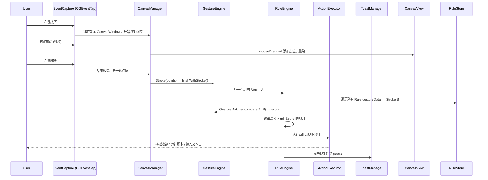

# MacStroke Swift 重构设计文档

**日期**: 2026-09-15  
**作者**: Claude Code (基于 mtjo/MacStroke 原项目)  
**状态**: 待用户审阅

---

## 1. 背景与目标

- **源项目**: [mtjo/MacStroke](https://github.com/mtjo/MacStroke) —— macOS 全局鼠标手势应用（Objective-C + Xcode）
- **目标**: 在 `/Users/mtjo/work/MacStroke-Swift` 从零用 **Swift** 完整重构，采用 **Swift Package Manager** 管理，UI 以 **SwiftUI + AppKit 混合** 实现，架构 **高度模块化**
- **最低目标**: macOS 13 Ventura (Swift 5.9 / Xcode 15+)，预留 Swift 6 迁移路径
- **数据兼容**: **全新数据模型**（Codable + JSON + SQLite），不兼容旧版 `NSUserDefaults`/`plist` 配置

---

## 2. 功能范围（完整移植）

| 子系统 | 原项目关键类 | 重构策略 |
|---|---|---|
| 手势捕获与绘制 | `AppDelegate` CGEventTap、`CanvasWindowController`、`CanvasView` | Swift `EventCapture` 模块 + `CanvasView: NSView`（保留绘图逻辑） |
| 手势识别引擎 | `Stroke`、`JOPoint`、`GestureCompare`（DTW 算法） | **纯 Swift 算法模块** `GestureEngine`，完全可单测 |
| 规则引擎 | `RulesList`、`Rule`（方向、过滤、动作类型） | `RuleStore` + `Rule` Codable 模型，支持通配符/正则过滤、动作执行 |
| 偏好设置窗口 | `AppPrefsWindowController` (xib) | SwiftUI `PreferencesView` 系列，`PreferencesStore` 统一状态 |
| 状态栏菜单 | `AppDelegate` `NSStatusItem` | `StatusBarController` (AppKit) |
| 右键菜单扩展 | `RightClickMenu`、`FinderSyncExtension` | `RightClickMenuStore` + 独立 Finder Sync Extension target |
| 历史剪贴板 | `HistoryClipboard`、`LSQLiteDB` | `ClipboardMonitor` + `ClipboardHistoryStore` (SQLite.swift/GRDB) |
| AppleScript 执行 | `AppleScriptCommand`、`AppleScriptsList` | `AppleScriptRunner` (NSAppleScript 封装) + 脚本列表管理 |
| Toast 提示 | `CoolToast` (子项目) | `ToastManager` (纯 Swift 封装 NSUserNotification / 自定义窗口) |
| 预设手势模板 | `PreGesture` (字母/符号预设路径) | `GestureTemplateProvider` 静态数据 |
| 应用选择器 | `AppPickerWindowController` | SwiftUI `AppPickerView` |
| 蓝牙设备查询 | `BtDelegate` | 保留可选模块 `BluetoothScanner` (IOBluetooth) |
| 自动更新 | Sparkle (`SUUpdater`) | 保留 Sparkle 集成 |

---

## 3. 总体架构

```
MacStrokeApp (NSApplicationDelegate)
│
├── EventCapture          # CGEventTap 全局鼠标事件捕获、分发
│   └── CanvasManager     # 多屏 CanvasWindow 生命周期、点位收集
│
├── GestureEngine         # 纯算法：Stroke、GesturePoint、GestureMatcher (DTW)
│   └── GestureTemplateProvider  # 预设手势模板
│
├── RuleEngine
│   ├── RuleStore         # 规则 CRUD、持久化、通配符/正则匹配
│   ├── ActionExecutor    # 快捷键/脚本/文本/密码/Shell 执行
│   └── Matcher           # 规则评分、最高分选择、阈值过滤
│
├── WindowManager
│   ├── StatusBarController     # NSStatusItem 菜单栏图标、菜单
│   ├── CanvasWindow/CanvasView # 透明全屏窗口、手势绘制 (NSView)
│   └── ToastManager            # Toast 提示 (自定义窗口/NSUserNotification)
│
├── Preferences (SwiftUI)
│   ├── PreferencesStore      # @Observable 全局偏好状态
│   ├── GeneralPreferencesView
│   ├── RulesPreferencesView
│   ├── ScriptsPreferencesView
│   ├── FiltersPreferencesView
│   ├── RightClickPreferencesView
│   ├── ClipboardPreferencesView
│   └── AppPickerView         # 应用选择器
│
├── Storage
│   ├── PreferencesModel      # Codable 偏好，UserDefaults + JSON 双写
│   ├── RuleCollection        # 规则集合 JSON 文件 + 版本迁移钩子
│   └── ClipboardHistoryStore # SQLite (SQLite.swift)
│
├── AppleScriptRunner         # NSAppleScript 封装、脚本列表管理
│
├── FinderSyncExtension       # 独立 App Extension Target
│   └── FinderCommChannel     # 分布式通知通信 (主 App ↔ Extension)
│
└── BluetoothScanner (可选)   # IOBluetooth 设备扫描
```

---

## 4. 核心数据流（手势识别闭环）



---

## 5. 关键数据模型

### 5.1 GestureEngine 基础类型

```swift
// Sources/GestureEngine/Models/GesturePoint.swift
public struct GesturePoint: Codable, Equatable {
    public var x: Double
    public var y: Double
    public var t: Double = 0      // 归一化时间 [0,1]
    public var dt: Double = 0     // 时间差
    public var alpha: Double = 0  // 角度 / π [-1, 1]
    
    public init(x: Double, y: Double) { self.x = x; self.y = y }
}

// Sources/GestureEngine/Models/Stroke.swift
public struct Stroke: Codable {
    public private(set) var points: [GesturePoint] = []
    public private(set) var capacity: Int
    
    public init(capacity: Int = 256) { self.capacity = capacity }
    
    public mutating func addPoint(_ p: GesturePoint) {
        guard points.count < capacity else { return }
        points.append(p)
    }
    
    // 归一化：平移缩放到 [0,1]²、计算 t/dt/alpha
    public mutating func normalize() { ... }
}
```

### 5.2 规则模型

```swift
// Sources/RuleEngine/Models/Rule.swift
public enum FilterType: String, Codable { case wildcard, regex }
public enum ActionType: Codable, Equatable {
    case shortcut(flags: UInt, keyCode: UInt16)
    case appleScript(id: String)
    case text(String)
    case password(String)          // 安全输入，Keychain 或加密存储
    case shell(command: String)    // 扩展：原项目隐含支持
}

public struct Rule: Codable, Identifiable, Equatable {
    public let id: UUID
    public var direction: String           // 手势名称/描述
    public var gestureData: [GesturePoint] // 模板手势点位
    public var filter: String              // Bundle ID 通配符/正则
    public var filterType: FilterType
    public var action: ActionType
    public var note: String                // Toast 提示文本
    public var triggerOnEveryMatch: Bool
    public var createdAt: Date
    public var updatedAt: Date
}
```

### 5.3 偏好模型

```swift
// Sources/Storage/Models/PreferencesModel.swift
public struct PreferencesModel: Codable {
    // 通用
    public var showIconInStatusBar: Bool = true
    public var launchAtLogin: Bool = false
    public var showUIInWhateverApp: Bool = false
    public var blockFilter: String = ""           // 黑名单 bundle ID
    public var whiteListMode: Bool = false        // false=黑名单 true=白名单
    public var whiteList: String = ""
    
    // 手势识别
    public var minScore: Double = 65.0            // 匹配阈值 0~100 (原 compareByGestureA 返回值域)
    public var enableGestureMinScore: Bool = true
    public var showGestureNote: Bool = true
    public var noteRetentionTime: Int = 2
    public var notePosition: Int = 1              // 0鼠标 1屏幕中心 2右上...
    public var noteBackgroundAlpha: Double = 0.7
    public var noteFontName: String = "Helvetica"
    public var noteFontSize: Double = 14
    public var showNoteIcon: Bool = true
    
    // 绘制
    public var disableMousePath: Bool = false
    public var lineColorHex: String = "#0000FFFF" // 蓝色
    public var lineWidth: Double = 4.0
    
    // 右键菜单
    public var enableRightClickMenu: Bool = true
    public var enableNewFile: Bool = true
    public var enableOpenInTerminal: Bool = true
    public var enableCopyFilePath: Bool = true
    
    // 剪贴板
    public var clipboardLimitTop: Int = 50
    public var clipboardLimitTotal: Int = 500
    public var clipboardSaveDays: Int = 7
    
    // 更新
    public var autoCheckUpdates: Bool = true
}
```

---

## 6. 关键模块接口设计

### 6.1 EventCapture

```swift
// Sources/EventCapture/EventCapture.swift
public final class EventCapture {
    public typealias Handler = (CGEvent) -> CGEvent?
    
    public var onRightMouseDown: ((CGPoint) -> Void)?
    public var onRightMouseDragged: ((CGPoint) -> Void)?
    public var onRightMouseUp: ((CGPoint) -> Void)?
    public var onLeftMouseDown: ((CGPoint) -> Void)?
    
    public func start() throws { ... }
    public func stop() { ... }
    // 内部：CGEventTapCreate(kCGHIDEventTap, kCGHeadInsertEventTap, ...)
}
```

### 6.2 CanvasManager

```swift
// Sources/WindowManager/CanvasManager.swift
public final class CanvasManager {
    public var onGestureCompleted: (([GesturePoint]) -> Void)?
    
    public func handleMouseDown(at point: CGPoint) { ... }
    public func handleMouseDragged(to point: CGPoint) { ... }
    public func handleMouseUp(at point: CGPoint) { ... }
    // 多屏支持：NSScreen.main 变化时重建窗口
}
```

### 6.3 GestureMatcher (DTW 核心)

```swift
// Sources/GestureEngine/GestureMatcher.swift
public final class GestureMatcher {
    public static let infinity: Double = 0.2
    public static let costMultiplier: Double = 2.5
    
    /// 返回 0~100 分数，100 为完全匹配
    public static func compare(template: Stroke, candidate: Stroke) -> Double {
        // 1. 双方 normalize()
        // 2. DP 计算最小代价路径 (stroke_compareWithStrokeA)
        // 3. score = max(1 - costMultiplier * cost, 0) * 100
    }
}
```

### 6.4 RuleStore

```swift
// Sources/RuleEngine/RuleStore.swift
@Observable
public final class RuleStore {
    public private(set) var rules: [Rule] = []
    
    public func add(_ rule: Rule) { ... }
    public func update(_ rule: Rule) { ... }
    public func remove(id: UUID) { ... }
    public func match(bundleID: String, gesture: Stroke) -> Rule? {
        // 1. 过滤器匹配 (wildcard/regex)
        // 2. 逐条 GestureMatcher.compare
        // 3. 选 score > minScore 且最高者
    }
    public func save() throws { ... } // JSON 文件
    public static func load() throws -> RuleStore { ... }
}
```

### 6.5 ActionExecutor

```swift
// Sources/RuleEngine/ActionExecutor.swift
public final class ActionExecutor {
    public func execute(_ action: ActionType, for rule: Rule) {
        switch action {
        case .shortcut(let flags, let keyCode):
            pressKey(flags: flags, keyCode: keyCode)
        case .appleScript(let id):
            AppleScriptRunner.shared.runScript(id: id)
        case .text(let str):
            typeText(str)
        case .password(let str):
            typeSecureText(str) // 通过 AX API 或安全输入
        case .shell(let cmd):
            runShellCommand(cmd)
        }
    }
}
```

### 6.6 PreferencesStore (SwiftUI 单一数据源)

```swift
// Sources/Preferences/PreferencesStore.swift
@Observable
public final class PreferencesStore {
    public var model: PreferencesModel
    public init() { self.model = Self.load() }
    
    public func save() { ... } // UserDefaults + JSON 备份
    private static func load() -> PreferencesModel { ... }
}
```

---

## 7. 持久化设计

| 数据 | 存储位置 | 格式 | 版本化 |
|---|---|---|---|
| 偏好设置 | `~/Library/Preferences/net.mtjo.MacStroke.plist` + `~/Library/Application Support/MacStroke/preferences.json` | UserDefaults (Codable) + JSON 双写 | `schemaVersion: Int` |
| 规则集合 | `~/Library/Application Support/MacStroke/rules.json` | JSON (Rule 数组) | `rulesSchemaVersion` |
| 剪贴板历史 | `~/Library/Application Support/MacStroke/clipboard.sqlite` | SQLite (SQLite.swift) | 表 schema version |
| 手势模板 | Bundle 资源 `GestureTemplates.json` | JSON | 静态资源 |

**迁移策略**: 每次 `load()` 检查版本号，提供 `migrate(from:to:)` 钩子，首次启动若检测到旧版 `net.mtjo.MacStroke.plist` 可提供“导入旧配置”入口（可选，优先级低）。

---

## 8. UI 设计 (SwiftUI + AppKit)

| 界面 | 技术 | 说明 |
|---|---|---|
| 偏好窗口 | `NSWindow` + `NSHostingView` 嵌入 SwiftUI | 左侧分类列表、右侧详情，支持调整大小 |
| 手势绘制画布 | `CanvasView: NSView` (Core Graphics 绘制) | 保留原 `drawRect` 逻辑，Swift 重写 |
| 状态栏菜单 | `NSStatusItem` + `NSMenu` (纯 AppKit) | 启用/禁用、偏好、退出 |
| 右键菜单 | Finder Sync Extension + `NSMenu` | Extension 通过分布式通知与主 App 通信 |
| Toast | 自定义 `NSPanel` (无边框、层级高) | 支持位置、字体、背景透明度、自动消失、图标显隐 |
| 应用选择器 | SwiftUI `AppPickerView` (Sheet) | 运行中应用列表、图标、勾选、搜索 |

---

## 9. 权限与系统集成

- **辅助功能权限**: 首次启动检测 `AXIsProcessTrustedWithOptions([kAXTrustedCheckOptionPrompt: true])`，未授权弹窗引导
- **登录项**: `SMAppService` (macOS 13+) 替代旧 `LoginItem` API
- **全局事件捕获**: `CGEventTap` 需辅助权限；捕获 `kCGEventRightMouseDown/Up/Dragged` + `kCGEventLeftMouseDown`(阻断用)
- **Finder Sync**: 独立 Extension Target，通过 `NSDistributedNotificationCenter` 与主 App 双向通信
- **Sparkle 更新**: 保留 `SUUpdater`，AppCast URL 指向 GitHub Releases

---

## 10. 测试策略

| 层级 | 工具 | 覆盖目标 |
|---|---|---|
| 单元测试 | Swift Testing (Swift 5.9+) | `GestureEngine` 归一化、DTW 比分、边界情况 (点数<10 返回 0)<br>`RuleStore` 过滤匹配、增删改查、持久化往返<br>`PreferencesModel` Codable 往返、默认值 |
| 集成测试 | 自定义测试 App | `EventCapture` → `CanvasManager` → `GestureEngine` → `RuleEngine` 完整链路 |
| UI 验收 | 手动 | SwiftUI 偏好页各字段、状态栏菜单、Toast 显示、右键菜单触发 |
| 权限/沙箱 | 手动 | 首次启动授权流程、登录项、沙盒文件访问 |

**不做**: 自动化 UI 测试 (XCUITest 维护成本高，优先级低)。

---

## 11. 实施阶段 (建议顺序)

| 阶段 | 交付物 | 预估工作量 |
|---|---|---|
| **Phase 0: 项目骨架** | SwiftPM Package、基础 Target 结构、Git 初始化、CI (GitHub Actions) | 0.5 天 |
| **Phase 1: GestureEngine** | `Stroke`、`GesturePoint`、`GestureMatcher`、单测覆盖算法核心 | 2 天 |
| **Phase 2: EventCapture + CanvasManager** | CGEventTap 封装、多屏 CanvasWindow、手势点收集、绘制 | 2 天 |
| **Phase 3: RuleEngine 核心** | `Rule`、`RuleStore`、`ActionExecutor`、匹配逻辑、持久化 | 2 天 |
| **Phase 4: 闭环联调** | 串起 EventCapture → Canvas → GestureMatcher → RuleStore → ActionExecutor，验证全流程 | 1.5 天 |
| **Phase 5: Preferences (SwiftUI)** | `PreferencesStore`、6 个分类视图、AppPicker、数据绑定 | 3 天 |
| **Phase 6: 系统集成** | 状态栏菜单、ToastManager、登录项、辅助权限引导、Sparkle | 1.5 天 |
| **Phase 7: 右键菜单 + Finder Sync** | `RightClickMenuStore`、Finder Sync Extension、分布式通知通信 | 2 天 |
| **Phase 8: 历史剪贴板** | `ClipboardMonitor`、SQLite.swift、偏好限制、UI | 1.5 天 |
| **Phase 9: AppleScript + 扩展** | `AppleScriptRunner`、脚本列表管理、Shell 动作、预设手势模板 | 1 天 |
| **Phase 10: 收尾** | 图标/资产、本地化 (zh-Hans/en)、文档、Release 流程 | 1 天 |

**总计**: ~17.5 天 (约 3.5 周，单人全职)

---

## 12. 风险与缓解

| 风险 | 影响 | 缓解 |
|---|---|---|
| CGEventTap 在 macOS 版本间行为差异 (超时、权限) | 核心功能失效 | Phase 2 早期在 13/14/15 上验证；添加超时重建逻辑 |
| DTW 算法移植出现数值差异 | 识别准确率下降 | 保留原 Objective-C 实现作为对照，编写回归测试用例 (固定输入→固定输出) |
| SwiftUI 在 macOS 13/14 上的 Bug (NSTableView 等) | 偏好页交互异常 | 复杂表格/树形视图保留 AppKit (`NSTableView` 包装) |
| Finder Sync Extension 沙箱通信失败 | 右键菜单不出现 | 早期 Phase 7 验证分布式通知 + App Group 方案 |
| SQLite.swift 编译/链接问题 | 剪贴板模块阻塞 | 备选 GRDB 或直接用 `sqlite3` C API 封装 |
| Sparkle 签名/公钥配置 | 自动更新失败 | Phase 6 预留时间配置 `dsa_pub.pem`、AppCast |

---

## 13. 验收标准

1. **核心闭环**: 按住右键画手势 → 松开 → 触发对应动作 (快捷键/脚本/文本/Shell)，Toast 显示注记
2. **规则管理**: 偏好窗口可增删改查规则、录制手势、设置过滤器/动作，持久化生效
3. **多屏支持**: 外接显示器连接/断开、切换空间时 CanvasWindow 正确重建
4. **权限流程**: 首次启动自动弹出辅助权限引导，授权后无需重启即可工作
5. **状态栏**: 图标显示/隐藏、菜单项启用/禁用/偏好/退出均正常
6. **右键菜单**: Finder 中右键文件/文件夹出现“新建文本文件/在终端打开/复制路径”
7. **剪贴板历史**: 复制文本/图片自动记录，偏好限制生效，UI 可浏览/粘贴
8. **AppleScript**: 偏好页可增删脚本、规则可引用执行
9. **数据隔离**: 重启 App 后所有规则、偏好、剪贴板历史保持
10. **构建通过**: `swift build -c release` 无警告，GitHub Actions CI 绿色

---

## 14. 后续步骤

- ✅ 设计文档完成（本文档）
- ⏳ **用户审阅** —— 请检查范围、架构、数据模型、阶段划分是否符合预期
- 🔜 审阅通过后，调用 `writing-plans` skill 生成详细实施计划 (Task 分解、依赖、验收)
- 🔜 按计划逐 Phase 实现，每 Phase 完成运行验证

---

**文档位置**: `docs/superpowers/specs/2026-09-15-macstroke-swift-design.md`  
**下一步**: 请审阅并确认，或提出修改意见。